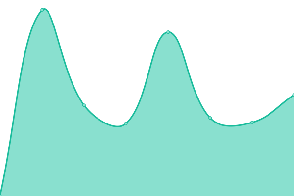

# [📈 Live Status](https://hernad.github.io/upptime): <!--live status--> **🟩 All systems operational**

This repository contains the open-source uptime monitor and status page for [Ernad Husremović](https://www.linkedin.com/in/hernad), powered by [Upptime](https://github.com/upptime/upptime).

With [Upptime](https://upptime.js.org), you can get your own unlimited and free uptime monitor and status page, powered entirely by a GitHub repository. We use [Issues](https://github.com/hernad/upptime/issues) as incident reports, [Actions](https://github.com/hernad/upptime/actions) as uptime monitors, and [Pages](https://hernad.github.io/upptime) for the status page.

<!--start: status pages-->
<!-- This summary is generated by Upptime (https://github.com/upptime/upptime) -->
<!-- Do not edit this manually, your changes will be overwritten -->
<!-- prettier-ignore -->
| URL | Status | History | Response Time | Uptime |
| --- | ------ | ------- | ------------- | ------ |
|  [www.bring.out.ba](http://www.bring.out.ba) | 🟩 Up | [www-bring-out-ba.yml](https://github.com/hernad/upptime/commits/HEAD/history/www-bring-out-ba.yml) | 

 1644ms
     
 | 

<a href="https://status.bring.out.ba/history/www-bring-out-ba">96.96%</a>
    

|  [download bring.out.ba](http://download.bring.out.ba/host.txt) | 🟩 Up | [download-bring-out-ba.yml](https://github.com/hernad/upptime/commits/HEAD/history/download-bring-out-ba.yml) | 

 514ms
     
 | 

<a href="https://status.bring.out.ba/history/download-bring-out-ba">97.66%</a>
    

|  [next.cloud.out.ba](https://next.cloud.out.ba/s/NPAyfsYPeStzDTN/download) | 🟩 Up | [next-cloud-out-ba.yml](https://github.com/hernad/upptime/commits/HEAD/history/next-cloud-out-ba.yml) | 

 1605ms
     
 | 

<a href="https://status.bring.out.ba/history/next-cloud-out-ba">97.59%</a>
    

|  [redmine.bring.out.ba](https://redmine.bring.out.ba/) | 🟩 Up | [redmine-bring-out-ba.yml](https://github.com/hernad/upptime/commits/HEAD/history/redmine-bring-out-ba.yml) | 

 1346ms
     
 | 

<a href="https://status.bring.out.ba/history/redmine-bring-out-ba">97.67%</a>
    

|  [bring.out odoo](https://bringout.odoo.cloud.out.ba/) | 🟩 Up | [bring-out-odoo.yml](https://github.com/hernad/upptime/commits/HEAD/history/bring-out-odoo.yml) | 

 1283ms
     
 | 

<a href="https://status.bring.out.ba/history/bring-out-odoo">97.60%</a>
    

|  [keycloak.bring.out.ba](https://keycloak.cloud.out.ba/) | 🟩 Up | [keycloak-bring-out-ba.yml](https://github.com/hernad/upptime/commits/HEAD/history/keycloak-bring-out-ba.yml) | 

 1283ms
     
 | 

<a href="https://status.bring.out.ba/history/keycloak-bring-out-ba">97.61%</a>
    

|  [headscale](https://headscale.out.ba/register/nodekey:aff680ab34bbd3bfcb3b076910d0543eeea1234f53dd0464a423c8f056e1cf99) | 🟩 Up | [headscale.yml](https://github.com/hernad/upptime/commits/HEAD/history/headscale.yml) | 

 815ms
     
 | 

<a href="https://status.bring.out.ba/history/headscale">98.22%</a>
    

|  [dns paris](pub3.out.ba) | 🟩 Up | [dns-paris.yml](https://github.com/hernad/upptime/commits/HEAD/history/dns-paris.yml) | 

 110ms
     
 | 

<a href="https://status.bring.out.ba/history/dns-paris">100.00%</a>
    

|  [dns frankfurt](pub1.out.ba) | 🟩 Up | [dns-frankfurt.yml](https://github.com/hernad/upptime/commits/HEAD/history/dns-frankfurt.yml) | 

 117ms
     
 | 

<a href="https://status.bring.out.ba/history/dns-frankfurt">100.00%</a>
    

<!--end: status pages-->

[**Visit our status website →**](https://hernad.github.io/upptime)

## 📄 License

- Powered by: [Upptime](https://github.com/upptime/upptime)
- Code: [MIT](./LICENSE) © [Anand Chowdhary](https://anandchowdhary.com), supported by [Pabio](https://pabio.com)
- Data in the `./history` directory: [Open Database License](https://opendatacommons.org/licenses/odbl/1-0/)
